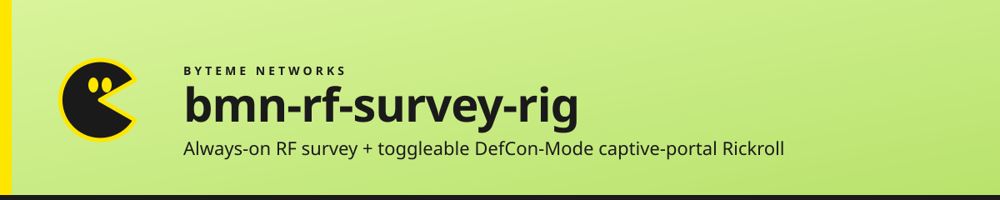

  

# bmn-rf-survey-rig

_A pocketable Raspberry Pi 4 + MikroTik mAP lite appliance: a continuous RF scanner that surfaces what's actively talking on the FM voice bands (with squelch tones decoded), plus a toggleable DefCon-style captive-portal Rickroll for laughs._

---

## Contents

- [What this is](#what-this-is)
- [⭐ Features](#-features)
- [🧸 Motivation](#-motivation)
- [🛠 Hardware](#-hardware)
- [🚦 What it WILL NOT do](#-what-it-will-not-do)
- [📐 Design docs](#-design-docs)
- [🚀 Status + roadmap](#-status--roadmap)
- [🚧 Known limitations](#-known-limitations)
- [Contributing](#contributing)
- [License](#license)
- [Maintainer](#maintainer)

---

## What this is

A pocketable appliance built for **situational RF awareness at outdoor events** — horse shows, fairgrounds, parks, fly-ins, any place where there's chatter on FM voice bands and you'd like to know what's active without manually tuning around.

**Primary role (always on):** RF scanner using two NooElec RTL-SDR dongles. One feeds an OpenWebRX instance for live audio (point it at a channel and listen); the other runs a custom scanner that hunts for active FM voice channels across the bands you care about, decodes the CTCSS/DCS subaudible squelch tones, and logs each transmission burst to a SQLite-indexed WAV archive on a USB stick. The phone-friendly local web UI shows you in plain text: *"462.6125 MHz, DCS 023, last heard 14 seconds ago, 6 hits in the last hour"* — exactly enough to decide whether to listen in or program your own handheld to join the conversation.

**Secondary role (toggleable):** captive-portal Rickroll for events where that's appropriate. MikroTik mAP lite broadcasts an open SSID, dnsmasq redirects every HTTP probe to a local web server, user lands on a Rickroll page. Disabled by default. No credential capture, no traffic interception, no phishing — just a harmless visual gag, the origin of the project before the scanner pivot became the real value.

This repo ships the design, RouterOS configurations, Pi systemd units, scanner code, captive-portal pages, and runbooks. Hardware is documented but not provided.

## ⭐ Features

- **Continuous RF scanner with tone decoding** — sweeps the bands you care about, surfaces active channels, decodes CTCSS / DCS subaudible squelch tones, indexes per-transmission WAV bursts in SQLite
- **Live-listen alongside** — one SDR is always feeding OpenWebRX, so you can tune to whatever the scanner just found
- **Built for the field** — phone-friendly web UI; tells you in plain text which freqs + tones are talking right now, so you can program your own handheld and join the conversation if you want
- **DefCon-Mode prank** — captive portal Rickroll on a separate SSID, disabled by default, toggled via Pi web UI or RouterOS shell
- **Offline-by-default** — no cloud, no telemetry, no phone-home; opt-in NAS sync over WireGuard to a single trusted target
- **Hard transparency** — every captive-portal page links to a `/transparency` page explaining what's happening, who runs it, and what's NOT being collected

## 🧸 Motivation

This started as a DEF CON captive-portal Rickroll. The kind of harmless gag where you stand up an open SSID, redirect any HTTP probe to a local page, and watch people get Rickrolled when they tap the Wi-Fi notification. Fun. Built for laughs.

Then I was at a horse show with a handheld radio, listening to barn chatter, and realized the more useful capability is the inverse of how most SDR setups work: I don't want to manually tune around hoping to catch something interesting. I want a thing that sits in my pocket, scans continuously, and tells me *"this freq is active right now, here's its squelch tone, here's how often it's lit up in the last hour"* — so I can decide whether to listen in, or punch the freq + tone into my own handheld and join the conversation.

So the scanner became the primary role. The Rickroll is still here — toggleable for events where that's the right vibe — but it's the side project now, not the headline. Same hardware, different center of gravity.

A note on "talk back": the rig itself is **receive-only**, by design (see safety boundaries below). When I want to transmit, that happens on a separately-licensed handheld radio I program with what the scanner discovered. The rig is the discovery layer; the operator's own radio is the transmit layer. This keeps the rig's legal posture clean and means anyone can build one without needing an amateur or business-radio license.

## 🛠 Hardware

- **Raspberry Pi 4B (4 GB)** — local web server, OpenWebRX host, scanner / tone decoder, captive portal host, admin dashboard
- **2 × NooElec RTL-SDR** — RF receive. One always-on for OpenWebRX, one for the survey scanner
- **MikroTik mAP lite** — routing, WAN uplink (5 GHz STA), captive portal controller (2.4 GHz AP), WireGuard client
- **USB thumb drive** — SQLite event index + WAV recordings + OpenWebRX logs (offloads write churn from the SD card)
- **2 antennas** — collapsible wideband discone (survey scanner), mag-mount wideband whip (monitor / recorder)
- **Battery** — any 100 W-class portable power bank for overnight; smaller USB-PD for floor stints

Full parts list and tested-good revisions pinned in `00_DESIGN.md` once parts are in hand.

## 🚦 What it WILL NOT do

Hard guardrails. These are non-negotiable design boundaries — not features that might appear later.

**Wi-Fi side (DefCon Mode):**
- ❌ No credential capture (no password fields, no email fields, no "fill this out to win" anything)
- ❌ No phishing (no impersonation of trusted brands or login pages)
- ❌ No traffic interception or TLS MITM
- ❌ No SSID impersonation of real secure networks
- ❌ No malware payloads

**RF side (always-on scanner):**
- ❌ No attempt to decode encrypted radio systems (P25, TETRA, government/public-safety encrypted talk groups, etc.)
- ❌ No cellular interception (LTE, GSM, etc.)
- ❌ **No transmit — ever.** The rig is receive-only on every band the SDR can hear. "Talk back" happens on a separately-licensed handheld radio the operator programs from what the scanner discovered — the rig itself never radiates.
- ❌ No data exfiltration outside the operator's own NAS
- ❌ No public posting of recorded content

If any contribution drifts toward these lines, it gets rejected on intent. See `00_DESIGN.md` §13 and §13b for the full canonical safety statement.

## 📐 Design docs

- **`00_DESIGN.md`** — current v2 dual-role spec (~78 KB; the canonical reference for any implementation work)
- **`00_DESIGN_v1.md`** — frozen original single-role captive-portal-only design (still authoritative for the Wi-Fi side details v2 carries forward)
- **`MASTER_CONTEXT.md`** — high-level project context: hardware, roles, division of labor, surface assignments
- **`05_LAPTOP_PLAYBOOK/`** — Windows 10 enterprise laptop RF capture testbed (sub-project, will likely promote to its own repo when it accumulates more mass)

## 🚀 Status + roadmap

**Phase:** Design (v2 complete 2026-05-25). No code or RouterOS configs published yet.

Implementation roadmap (per `00_DESIGN.md` §12 + Appendix A):

| Phase | What lands |
|---|---|
| 0 | Pi base image, mAP lite onboarded per BMN MikroTik convention |
| 1 | Pi mgmt AP (wlan0 + hostapd + dnsmasq) + admin dashboard skeleton |
| 2 | RF scanner: discovery sweep, tone decoder, SQLite event log |
| 3 | OpenWebRX integration + live-audio feed for the second SDR |
| 4 | NAS-sync over WireGuard (scheduled + ad-hoc) |
| 5 | DefCon Mode captive portal (HTML, dnsmasq, certs, transparency page) |
| 6 | DefCon Mode toggle UI + RouterOS REST scoped user |
| 7 | Hardware bring-up, antenna pinning, battery profiling |
| 8 | Field operation runbooks + first real-world deploy |

## 🚧 Known limitations

- **Receive-only** — the SDRs are receive-only by design. If you need transmit (e.g., for a SDR-based emergency comms rig), this isn't the project for that.
- **2.4 GHz captive portal only** — the mAP lite's 5 GHz radio is reserved for upstream STA, not for the prank. Some modern phones disprefer 2.4 GHz; the captive portal mostly catches older / fallback radios. Intentional.
- **Single-NAS sync target** — by design. No multi-destination upload; no public mirror. Add at your own risk + responsibility.
- **No transcription / no content publication** — recordings stay on the operator's NAS, never auto-published. You are responsible for any later use.
- **Folder name lag** — internal OneDrive folder is still `DefCon RickRoll Rpi+MapLite+BatteryBank/`; canonical project name is "BMN RF Survey Rig (w/ DefCon Mode)" but the folder rename is queued behind some Cowork registration moves.

## Contributing

See [CONTRIBUTING.md](CONTRIBUTING.md). PRs welcome. Before opening a PR for anything that touches the captive portal or RF scanner, **read `00_DESIGN.md` §13 (Wi-Fi guardrails) and §13b (RF guardrails) first.** Anything that drifts toward those hard-NO lists will be declined on intent regardless of how clean the code is.

## License

Licensed under **BMN Community Use (CU)** — see [LICENSE](LICENSE). CU is BMN's permissive open-reuse license, currently shipping as interim placeholder text (the canonical CU registry entry is pending). The `LICENSE` file is the authoritative source.

**ByteMe Networks branding** (logo, color marks, "BMN" mark, mascot) is reserved — forks should retire BMN branding before any public release. The functional code, RouterOS configs, design docs, and runbooks are freely reusable; the brand is not.

## Maintainer

Built and maintained by **Aaron Gustafson** at [ByteMe Networks, LLC](https://bytemenetworks.com) — Waco, TX.

Questions, design discussion, or "what about this safety edge case…" → open an issue or reach out: `aaron@bytemenetworks.com`.

  part of the BMN operations stack · <a href="https://github.com/Agustafson1990">@Agustafson1990</a>

